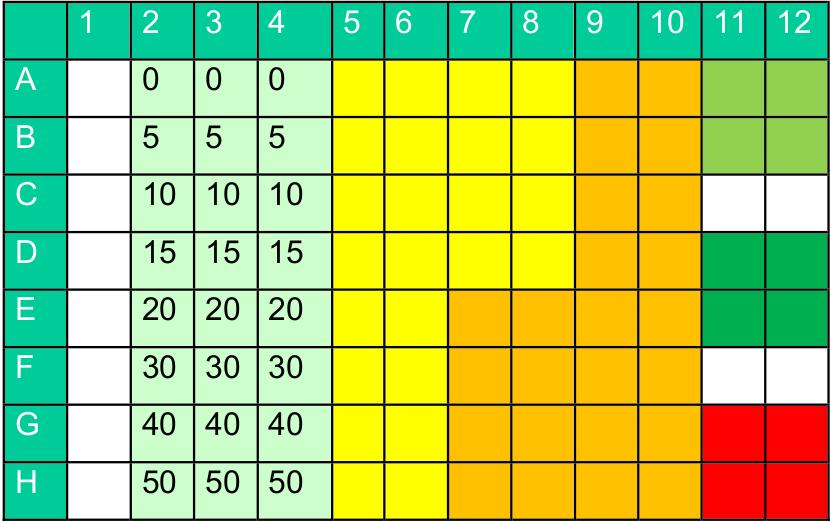

---
output:
    pdf_document
fontfamily: arev
---
```{r}
library(pander)
library(magrittr)
```
# Auswertung von 96-Well Platten

Bei der Auswertung von 96-Well Platten (96WP) verfügt der Experimentator über eine größere Menge an Werten als im Normalfall.
Dieses Plus kann aber in der Auswertung zu Schwierigkeiten führen, es absehbar, dass die Menge an Messdaten falsch importiert wird oder falsch weiterverarbeitet.
Das Pipettierschema ist hierbei der Schlüssel zum Erfolg, wenn dieses korrekt übertragen wird können Fehler beim Datenimport oder bei der Durchführung erkannt werden.
Die Messdaten werden in der Regel als Excel-Tabelle weitergegeben.
Es ist zwingend notwendig den Datensatz als isolierte Tabelle ohne Überhang und mit sinnvollen Spaltennamen zu importieren.
Beispiel wird die Konzentration an Humanserumalbumin (HSA) in verschiedenen Proben untersucht, im Datensatz sind sowohl die Messwerte einer Standardreihe, jene der Studentenurinproben als auch Patientenurinproben vorhanden.
Das Orginalpipettierschema, in hellgrün die Standardreihe, in gelb und hellgelb die Studentenurinproben und die tieferen grüntöne markieren die Auftragungsstellen des Patientenurin:

Der Import kann über readxl erfolgen:
```{r}
library(readxl)
HSA <- read_excel("HSA_Arno.xlsx", sheet = "Tabelle2") 
```
Wir wissen, dass die Standards in aufsteigender Reihenfolge in den Spalten s2, s3 und s4 aufgetragen wurden.
Unter Verwendung von dplyr::mutate() fällt es leicht den Durchschnitt zu berechnen und gleich eine Spalte mit der gemittelten Konzentration einzuführen:
```{r}
library(tidyverse)
HSA <- mutate(HSA, Std=((HSA$s2 + HSA$s3 + HSA$s4) / 3))
pander(HSA)
```
Aus dem Standard kann über biotech::plot_regression() eine Regressionsgerade geplottete werden:
```{r}
# Laden der Pakete
library(devtools)
load_all("../../Biotech")
# Substratkonzentration errechnen:
subs <- seq(0, 50, length.out = length(HSA$Std))
# plotten des Modells
plot_regression(abs = HSA$Std, conc = subs)
lm(subs[2:8]~HSA$Std[2:8]) %>%
    summary()
```
Die geplottete Regressions
Als nächstes wollen wir die Probenkonzentrationen untersuche, davor müssen wir diese aber auch aus den Rohdaten extrahieren.
Die Versuchsdurchführung sieht vor, dass die Proben (Urinproben der Studenten) in zwei verschiedenen Konzentrationen in den selben Spalten auftragen, diese müssen nun getrennt werden:
```{r}
# Die Spalten 5&6, 7&8 sowie 9&10 führen neben einander die 
# Probenabsorption
Proben.1 <- c((HSA$s5 + HSA$s6)/2 , (HSA$s7[1:4]+HSA$s8[1:4])/2)
Proben.2 <- c((HSA$s9 + HSA$s10)/2 , (HSA$s7[5:8]+HSA$s8[5:8])/2)
```
Nach diesem Schritt können wir nun die Konzentration der verdünnten Proben bestimmen, es bleibt zu beachten, dass die Standardreihe im ng-Bereich konzentriert ist.
Die Konzentrationen werden mit Biotech::conc_eval ermittelt:
```{r}
Ergebnisse <- tibble(
       conc.Proben.1 = conc_eval(abs_P = Proben.1, HSA$Std, subs),
       conc.Proben.2 = conc_eval(abs_P = Proben.2, HSA$Std, subs)
)
pander(Ergebnisse)
```
Uns ist bekannt, dass die Proben der Studenten für Proben.1 und Proben.2 1:1000 und 1:5000 verdünnt wurden, diese Information kann gleich ergänzt werden:
```{r}
Ergebnisse <- mutate(Ergebnisse, ist.conc.Proben.1 = conc.Proben.1 * 1000)
Ergebnisse <- mutate(Ergebnisse, ist.conc.Proben.2 = conc.Proben.2 * 5000)
pander(Ergebnisse)
```
Die Ergebnisse sind nun also die Konzentration der Proben in Nanogramm HSA je ml, die negativen Werte sind wahrscheinlich aus Proben entstanden, welche kein HSA enthielten und bei der Messung durch den Messfehler der teilweise veralteten Plattenleser entstanden.
Durch die Multiplikation mit dem Verdünnungsfaktor werden sie verstärkt sind aber für die Auswertung nicht relevant.
Die Urinproben der "Patienten" werden auch im ersten Schritt separiert:
```{r}
Ergebnisse.Patienten <- tibble(
Patient.1 = (sum(HSA[1:2, 11], HSA[1:2, 12]) / 4),
Patient.2 = (sum(HSA[4:5, 11], HSA[4:5, 12]) /4)
)
pander(Ergebnisse.Patienten)
```
Um die Auswertung zu erleichtern bietet es sich an eine Funktion einzuführen um die Konzentration aus dem selben Modell zu berechnen:
```{r}
cHSA <- function (abs.P) {
    conc_eval( abs.P,
               abs_std = HSA$Std,
               conc_std = subs
    )
}
```
Mit dieser Funktion können wir dann weiterrechnen:
```{r}
Ergebnisse.Patienten <- mutate(
                               Ergebnisse.Patienten, 
                               cHSA(Ergebnisse.Patienten$Patient.1), 
                               cHSA(Ergebnisse.Patienten$Patient.2)
) 
pander(Ergebnisse.Patienten)
```
Eine genauere Betrachtung der Ergebnisse liefert Gewissheit, dass auch hier etwas schief gelaufen ist während der Messung, es scheint, die Meisten Messwerte liegen außerhalb der gemessenen Standardreihe, wahrscheinlich ein Grund, dass viele negative Werte produziert wurden.

# Auswertung eines weiteren Datensatz

Dieser wird wie der 1. importiert :
```{r}
library(readxl)
HSA <- read_excel("HSA.xlsx", sheet = "Tabelle2")
```
Und wie der erste verarbeitet, dafür wurden die Schritte der vorangegangenen Auswertung in einer Funktion zusammengefasst:
```{r}
HSA_Cleanup <- function(HSA) {
list(  HSA <- mutate(HSA, Std=((HSA$s2 + HSA$s3 + HSA$s4) / 3)),
Proben <- tibble(
    Proben.1 = c((HSA$s5 + HSA$s6)/2 , (HSA$s7[1:4]+HSA$s8[1:4])/2),
    Proben.2 = c((HSA$s9 + HSA$s10)/2 , (HSA$s7[5:8]+HSA$s8[5:8])/2)
  ),
Patienten <- tibble(
    Patient.1 = (sum(HSA[1:2, 11], HSA[1:2, 12]) / 4),
    Patient.2 = (sum(HSA[4:5, 11], HSA[4:5, 12]) /4)
  ))
}

HSA.Clara <- HSA_Cleanup(HSA)
pander(HSA.Clara)
```
Die Standardreihe kann geplottet werden:
```{r}
plot_regression(abs = HSA.Clara[[1]]$Std[1:8], conc = subs[1:8] ) 
```
Der erste Wert der Standardreihe ist negativ, wir möchten nun untersuchen, in wie weit dieser und der 4. Wert das Bestimmtheitsmaß unserer Regression beeinflusst: 
```{r}
lm(HSA.Clara[[1]]$Std[1:8]~subs[1:8]) %>% 
    summary()
lm(HSA.Clara[[1]]$Std[2:8]~subs[2:8]) %>% 
    summary()
lm(HSA.Clara[[1]]$Std[-4]~subs[-4]) %>% 
    summary()
```
Wir sehen dass die Beeinflussung eher gering ist und gehen daher nicht weiter auf diese Umstände ein.
Für die Konzentrationsberechnung definieren wir eine neue Funktion:
```{r}
cHSA <- function(HSA, Proben.x, subs) {
  conc_eval(abs_P = Proben.x, abs_std = HSA[[1]]$Std[2:8], conc_std = subs[2:8])
}
```
Und wenden sie an:
```{r}
Ergebnisse.Proben <- tibble(
    ist.conc.1 = 5000 * cHSA(HSA = HSA.Clara, Proben.x = HSA.Clara[[2]]$Proben.1, subs = subs),
    ist.conc.2 = 1000 * cHSA(HSA = HSA.Clara, Proben.x = HSA.Clara[[2]]$Proben.2, subs = subs)
    ) 
pander(Ergebnisse.Proben)
```
Das selbe noch für die Patientenproben:
```{r}
Ergebnisse.Patienten <- tibble(
    ist.conc.P1 =  cHSA(HSA = HSA.Clara, Proben.x = HSA.Clara[[3]]$Patient.1, subs = subs),
ist.conc.P2 =  cHSA(HSA = HSA.Clara, Proben.x = HSA.Clara[[3]]$Patient.2, subs = subs)
)
pander(Ergebnisse.Patienten)
```


